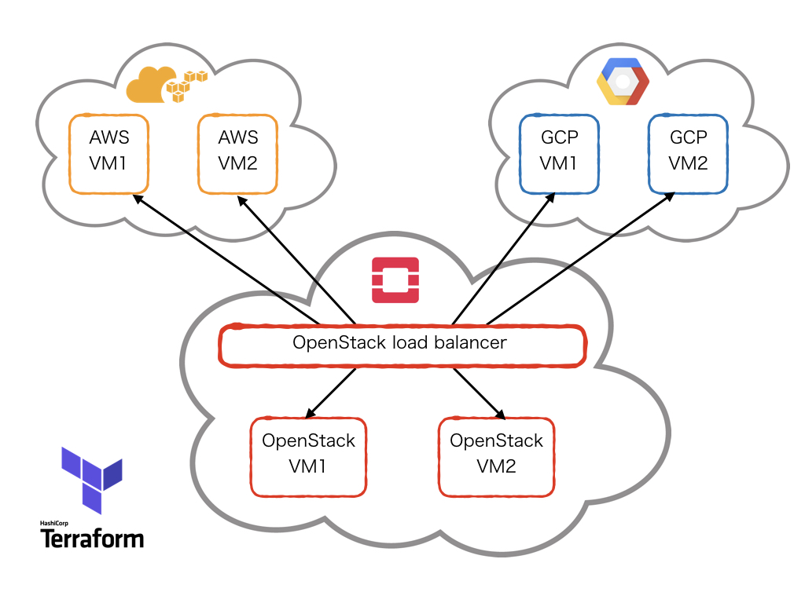

## Hybrid cloud environment

You will need access to all clouds (see the main page for more information on that).



This is a terraform demo created to show how to connect different cloud systems using terraform.

The architecture of the system itself is extremely simple, just a bunch of virtual machines with a basic webpage connected to an OpenStack load balancer.

Create the instances by applying the terraform files.
```bash
terraform apply
```
After all the instances are initialized, you can see how the load balancer is going through all the created instances with the "multi_curl" script.
```bash
../multi_curl
```
At the end, don't forget to destroy the created instances to prevent over-spending.
```bash
terraform destroy
```
